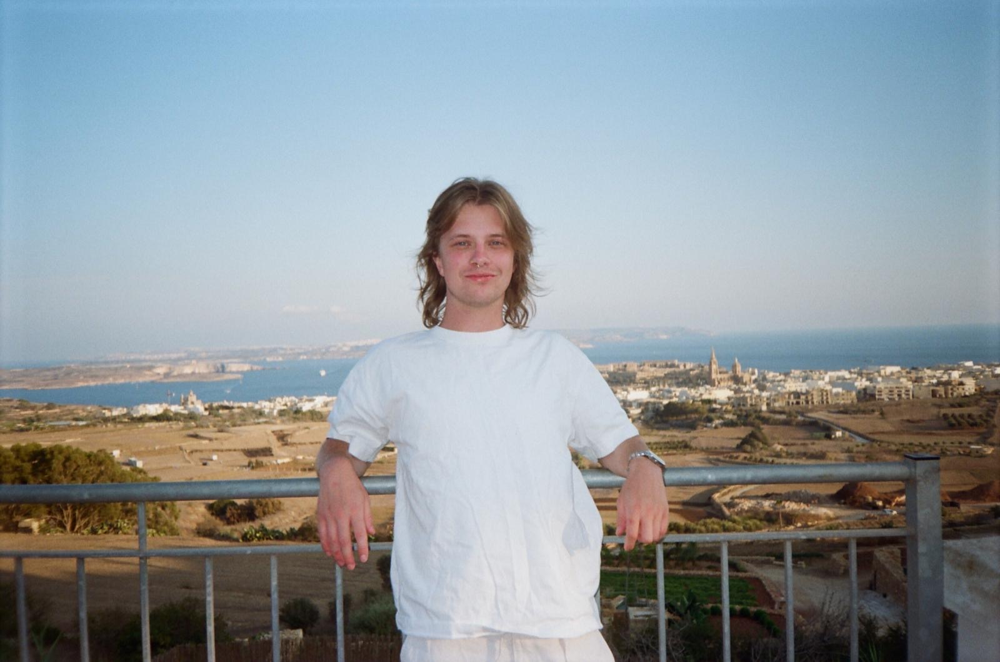

# Community Structure

Although we encourage our community to have a flat structure, it does have leaders that are responsible for administration and actions within the group.

Below are some of our members who help organise the group. 

## Community Founder - Jack Gee

### Responsibilities
Jack is currently responsible for the operations and communications of the group, mainly through connecting with members and organising events.

### Profile
> I founded "Devs in Malta" in October of 2024, after moving to Malta in April of 2024 and finding a lack of community run groups for developers on the island.
>
> I have 5 years of commercial experience in Data Science, Engineering, and Analytics; working with various industries to create and maintain big data pipelines for prediction and data-informed decision making.
>
> Before that, I studied Pure Mathematics in my hometown of Exeter, UK. I started programming seriously when working on primality testing / factorisation algorithms, and encapsulating more abstract mathematical ideas into code.
>
> Professionally, my current work focuses mostly on  automation and ETL pipelines in Python. I have been fortunate to work with many types of data including, but not limited to, streaming statistics and userdata, financial reports, and free-text surveys; and many types of technology such as ML / NN, IaC, and Distruted Systems.  
> 
> In my personal work, I am interested in functional languages and functional design. I currently write small apps and websites in Clojure and Gleam. 
>
> Outside of programming, I spend my free time reading, sewing, listening to Japanese Jazz, and learning more about Malta / Maltese Culture!
>
> If you'd like to connect, the best place to find me is Linkedin @ [Jack Gee](https://www.linkedin.com/in/jack-otto-gee/).
>
> I look forward to meeting you at events in the future! 🙂
