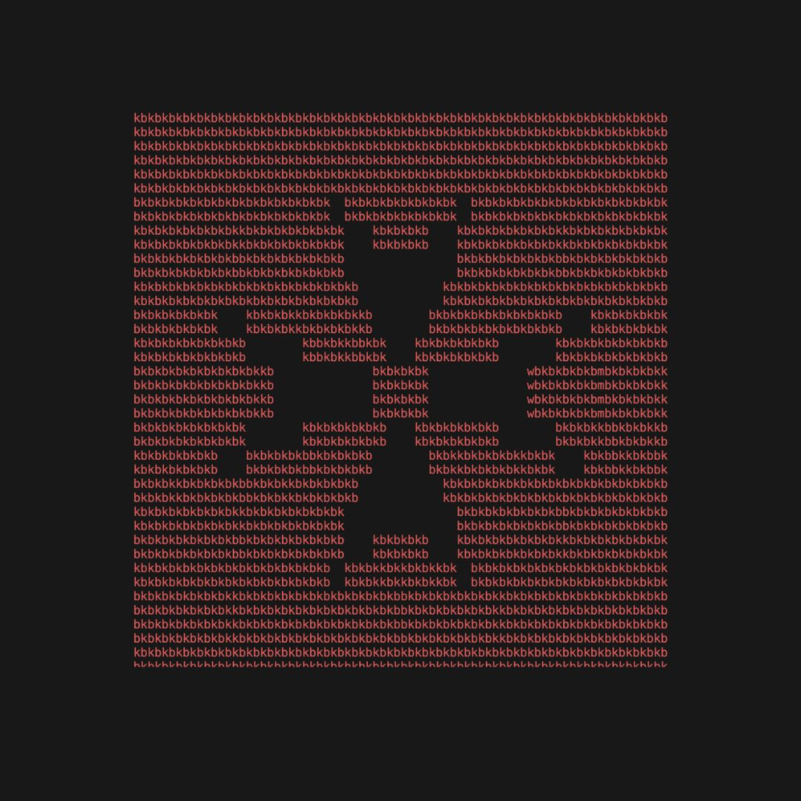

 "Devs in Malta" is a community lead group where programmers and enthusiasts can socialise, network, and share their skills.

We are an unaffiliated group and are independent from any programming language, technology, job title, or organisation. 

## Purpose and goals
From our tagline, we aim to achieve the following:
 - Curating an authentic space, both physically and digitally, for programmers to meet similar crafts-people and knowledge share.
 - Hosting of social events, such as:
    - Meetups ☕,
    - Activites 🎮.
 - Hosting technology based events, such as:
    - Tech talks / Show & Tells 🎙,
    - Hackathons 👾,
    - Workshops 🛠️,
    - Competitions 🏆.

## Resources
To join the group, please connect through any of our [Social Platforms](SOCIALS.md).

It is important that our members understand and adhere to our [Code of Conduct](CODE_OF_CONDUCT.md).

For more information on our community leaders, please check the [Community Structure](COMMUNITY_STRUCTURE.md) page. 

